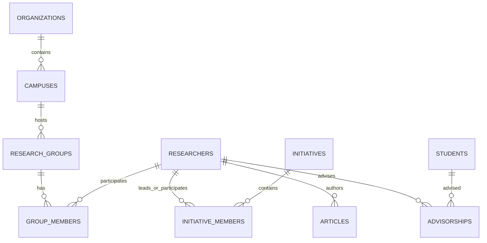

# Data Model: Backup Database Merger

## Entities & Schemas

### 1. Backup Database Structure (`data/backup/horizon_backup.db`)

O banco de dados SQLite de backup reflete as tabelas canônicas do domínio `research-domain` e `eo-lib`:

### 2. Merger Entity Mapping & Uniqueness Rules

| Entidade | Chave Primária Canônica | Chave de Deduplicação / Match | Comportamento de Fusão |
|---|---|---|---|
| `organizations` | `id` | `name`, `cnpj` | `INSERT OR IGNORE` |
| `campuses` | `id` | `name`, `organization_id` | `INSERT OR IGNORE` |
| `researchers` | `id` | `lattes_id`, `email`, `name` | Se ausente, copia do backup; se presente, atualiza novos atributos |
| `students` | `id` | `name`, `lattes_id` | Se ausente, copia do backup; se presente, atualiza |
| `research_groups` | `id` | `cnpq_url`, `name` | Se ausente, copia 344 grupos com campus/org; se presente, atualiza |
| `initiatives` | `id` | `sigpesq_id`, `title` | Se ausente, copia do backup (com metadados Mistral); se presente, atualiza |
| `articles` | `id` | `doi`, `title` | `INSERT OR IGNORE` |
| `advisorships` | `id` | `researcher_id`, `student_name`, `title` | `INSERT OR IGNORE` |
| `knowledge_areas` | `id` | `code`, `name` | `INSERT OR IGNORE` |

### 3. State & Manifest Metadata (`_meta.json` / `_provenance`)

- Durante a fusão, se uma entidade for preenchida a partir do backup, o `ProvenanceTracker` anota a proveniência como `[BACKUP_DB]`.
- Se a entidade foi atualizada por raspagem fresca ao vivo, a proveniência é `[LIVE]`.
