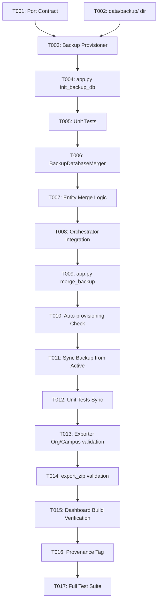

# Tasks: Backup Database Merger (Fusão Resiliente de Dados Históricos)

**Input**: Design documents from `/specs/010-backup-database-merger/`
**Prerequisites**: plan.md, spec.md, research.md, data-model.md, contracts/

## Format: `[ID] [P?] [Story] Description`
- **[P]**: Can run in parallel (different files, no dependencies)
- **[Story]**: Which user story this task belongs to (e.g., US1, US2, US3)

---

## Phase 1: Setup (Shared Infrastructure)

**Purpose**: Project initialization and basic structure for the backup merger.

- [x] T001 Create port interface contract `IBackupDatabaseMerger` in `src/core/ports/backup_merger_port.py`
- [x] T002 Create backup storage directory `data/backup/` with `.gitignore` for temporary SQLite lock files

---

## Phase 2: Foundational (Blocking Prerequisites)

**Purpose**: Core provisioning infrastructure that must be complete before merger execution.

- [x] T003 [P] Implement `BackupDatabaseProvisioner` in `src/core/logic/backup_db_provisioner.py` to extract and populate `data/backup/horizon_backup.db` from `data/exports/novo_backup.zip`
- [x] T004 Add CLI entrypoint `init_backup_db` in `app.py` to trigger backup database provisioning

**Checkpoint**: Foundation ready - `data/backup/horizon_backup.db` can be provisioned and accessed.

---

## Phase 3: User Story 1 - Preservação e Fusão Automática de Dados (Priority: P1) 🎯 MVP

**Goal**: Mesclar automaticamente dados do banco de backup no banco ativo antes da exportação canônica quando fontes externas falharem.

**Independent Test**: Executar a fusão em um banco ativo vazio e verificar se 100% dos dados históricos são transferidos com integridade referencial.

### Tests for User Story 1
- [x] T005 [P] [US1] Create unit tests for backup merger in `tests/test_backup_merger.py` (empty active DB, partial active DB, deduplication)

### Implementation for User Story 1
- [x] T006 [US1] Implement `BackupDatabaseMerger` in `src/core/logic/backup_merger.py` using SQLite `ATTACH DATABASE`
- [x] T007 [US1] Implement entity merge logic for `campuses`, `organizations`, `researchers`, `students`, `research_groups`, `initiatives`, `articles`, and `advisorships` in `src/core/logic/backup_merger.py`
- [x] T008 [US1] Integrate `merge_backup` step into `src/flows/pipelines/weekly_orchestrator.py` prior to `export_canonical`
- [x] T009 [US1] Add CLI argument `merge_backup` in `app.py` to allow standalone execution

**Checkpoint**: User Story 1 fully functional and testable independently.

---

## Phase 4: User Story 2 - Provisionamento e Manutenção do Backup (Priority: P2)

**Goal**: Garantir que o banco de backup seja auto-provisionado na inicialização e atualizado após execuções 100% bem-sucedidas.

**Independent Test**: Simular ausência de `horizon_backup.db` e verificar provisionamento automático; simular weekly bem-sucedido e verificar atualização do backup.

### Implementation for User Story 2
- [x] T010 [P] [US2] Add auto-provisioning check in `src/flows/pipelines/weekly_orchestrator.py` before weekly pipeline starts
- [x] T011 [US2] Implement `sync_backup_from_active` in `src/core/logic/backup_merger.py` to update `horizon_backup.db` after successful weekly execution
- [x] T012 [US2] Add unit tests in `tests/test_backup_merger.py` verifying backup preservation and successful sync

**Checkpoint**: User Story 2 fully functional and testable independently.

---

## Phase 5: User Story 3 - Compatibilidade e Integridade Total com o Dashboard (Priority: P3)

**Goal**: Garantir que o `export.zip` resultante seja 100% compatível com o build estático do Dashboard.

**Independent Test**: Extrair o `export.zip` no dashboard e executar `npm run build` confirmando saída com código 0 e zero páginas quebradas.

### Implementation for User Story 3
- [x] T013 [US3] Ensure `ResearchGroupExporter` in `src/core/logic/research_group_exporter.py` guarantees valid `organization` and `campus` objects on all exported groups
- [x] T014 [US3] Ensure `scripts/export_zip.py` packages Mistral JSON reports (`project_sigpesq_files_json/`) and subgraphs into the output archive
- [x] T015 [US3] Add end-to-end verification script testing build integrity against `horizon_dashboard_h`

**Checkpoint**: User Story 3 fully functional and testable independently.

---

## Phase 6: Polish & Cross-Cutting Concerns

**Purpose**: Auditoria, proveniência e validação final.

- [x] T016 Update `src/core/logic/provenance_tracker.py` to register provenance tag `[BACKUP_DB]` for merged records
- [x] T017 Run full test suite with `.venv/bin/pytest tests/test_backup_merger.py`

---

## Dependencies & Completion Order

